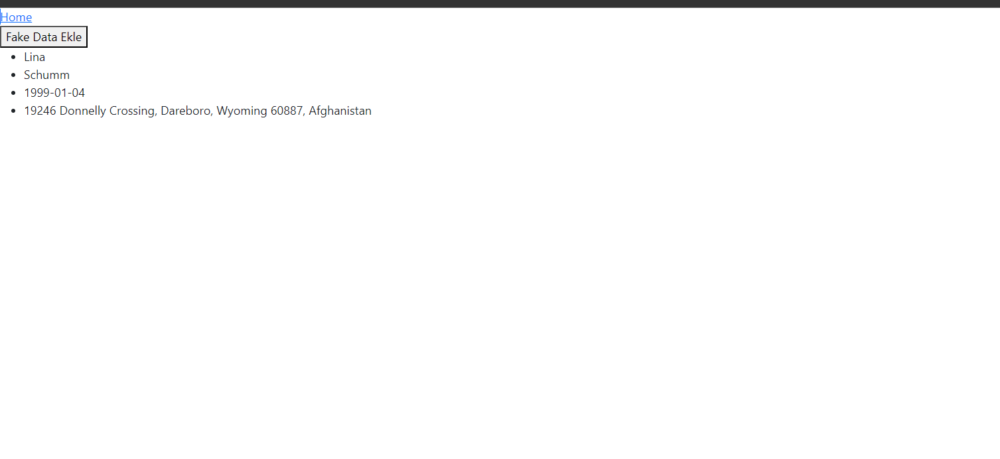

<p align="center">
   <a href="https://www.elastic.co" target="_blank" rel="noreferrer">  </a><a href="https://spring.io/" target="_blank" rel="noreferrer">  </a> <a href="https://reactjs.org/" target="_blank" rel="noreferrer">  </a>
</p>

<h3 align="center">Spring Elastic Search Api ve React </h3>

<div align="center">

[](/LICENSE)

</div>

---

## 🧐 About <a name = "about"></a>

Spring ile Elastic search ile hızlı arama yaptık


## 🏁 Başlangıç <a name = "getting_started"></a>


### Kurulum için gerekli programlar

- <a href="https://www.docker.com/products/docker-desktop/">Docker</a>  

### Installing

```
git clone https://github.com/abdullahciftci034/SpringBoot-ElasticSearch-React-App.git
```
```
cd SpringBoot-ElasticSearch-React-App
```
```
docker-compose build
```
```
docker-compose up
```
browserdan açın:
<a href="http://localhost">http://localhost</a>
### 📝 İçerik
- Docker
- React
- Spring
- Elatic Search

Çalışmayan komponenti tekrar çalıştırın
### Preview



